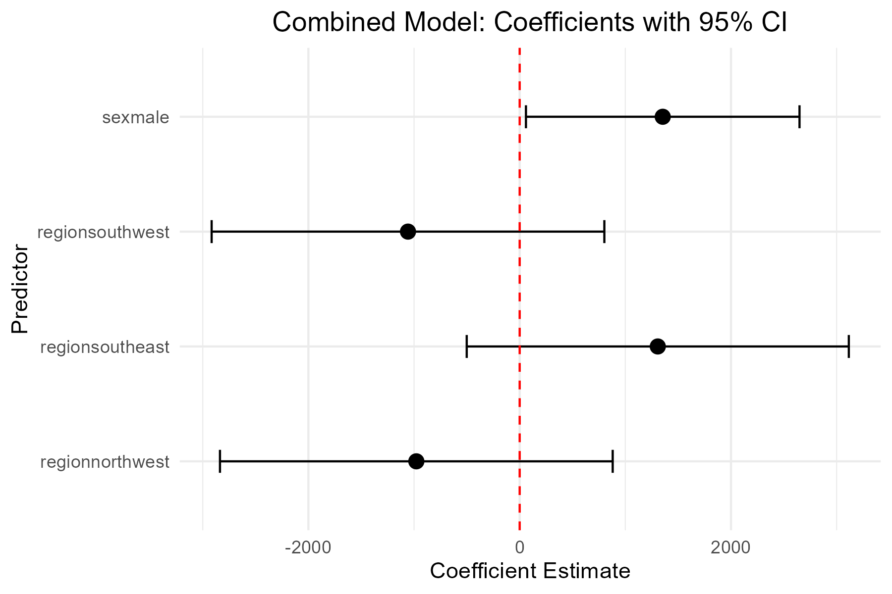

# Project 3 — Categorical Predictors & Dummy Variables (Insurance Dataset)

## 📌 Project Goal
Learn how to handle **categorical predictors** in regression models using **dummy variables**.  
The focus is on **methodology and understanding**, not on clinical or predictive inference.

## 📊 Dataset
- Source: `insurance.csv`  
- Variables:  
  - `charges` (Insurance charges in USD)  
  - `sex` (Male / Female)  
  - `region` (northeast, northwest, southeast, southwest)  
  - `age`, `bmi`, `children`, `smoker` (available but not main focus here)  

## 🧪 Analysis Overview
- Data quality checks (`glimpse`, `summary`, missing values)  
- Convert categorical variables to factors (`sex`, `region`, `smoker`)  
- Exploratory Data Analysis (EDA):  
  - Summary statistics by sex and region  
  - Boxplots for charges by sex and region  
- Understanding dummy variable encoding in R:  
  - Treatment coding (k-1 dummies)  
  - Manual dummy variable creation to verify results  
- Regression models:  
  - Sex only  
  - Region only  
  - Combined model (Sex + Region)  
- Model comparison using R², ANOVA, AIC, BIC  
- Coefficient plots with 95% confidence intervals  

## 📈 Key Findings
- **Sex**: Males pay ~$1,387 more than females on average; R² ≈ 0.005  
- **Region**: Differences across regions are small; R² ≈ 0.006  
- **Combined model (Sex + Region)**: R² ≈ 0.011 → minimal increase, showing weak predictive power  
- Statistical significance observed in some coefficients due to sample size, but practical impact is small  

## 🧠 Key Concepts Demonstrated
- **Dummy Variable Encoding:**  
  R automatically converts categorical variables to k-1 dummy variables with a reference category.  

- **Reference Category:**  
  By default, R chooses the alphabetically first category.  
  Changing the baseline (using `relevel()`) alters interpretation but not model fit.  

- **Coefficient Interpretation:**  
  - Intercept → mean outcome for reference category  
  - Dummy coefficient → difference relative to reference  
  - Positive = higher charges, Negative = lower charges  

- **Manual Dummy Variables:**  
  Manually creating dummies produces identical results, confirming internal R encoding.  

## 🖼️ Visualization
- Boxplots of charges by sex and region  
- Coefficient plots with 95% CI for sex, region, and combined models  

## 📌 Conclusion
This project serves as a **learning exercise** to understand how categorical predictors are handled in regression:

- Understanding **dummy variables** and **reference categories** is essential for correctly interpreting coefficients.  
- Sex and region alone are weak predictors of insurance charges.  
- The project highlights the difference between **statistical significance** and **practical significance**.  
- Focused entirely on methodology, this project is **not intended for clinical or predictive use**.  

> Key takeaway: Mastery of dummy variable handling lays the foundation for more complex regression modeling with categorical predictors.
